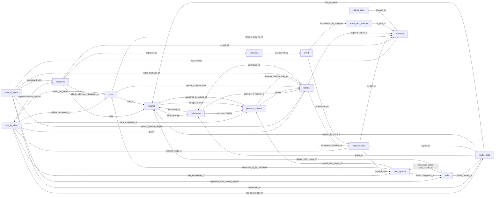

# Mystery Graph FROM

_Сгенерировано Claude Opus 4.7 через Perplexity Agent API. Источник: канон-выжимки 17 узлов из wiki._

**17 узлов, 49 связей**

## Узлы

### Boy in White (`boy_in_white`) [core_required]

A mysterious vision appearing to select individuals in the Township, offering guidance and safety advice. He first appeared to Victor in the 1970s and later to Ethan, and instructed Christopher to go through the Bottle Tree to free the children.

Открытые вопросы:

- What is the true nature/origin of the Boy in White?
- Is he opposed to the Man in Yellow or an independent benevolent force?
- Why does he appear only to specific people (Victor, Ethan, Christopher)?
- What is his connection to the ritual murder of the children?

### Man in Yellow (`man_in_yellow`) [core_required]

An unknown malevolent entity, the main antagonist, who may control the Township. He can take human forms (currently posing as Sophia), manipulates inhabitants like Sara, and killed Jim Matthews after warning against digging the basement hole.

Открытые вопросы:

- What exactly is the Man in Yellow and does he control the Township?
- Why does he warn against digging in the basement?
- How can he time-travel/encounter Julie across timelines?
- What is his connection to Sophia and other forms he takes?

### The Township (`township`) [core_required]

A mysterious area in the middle of the US that traps all who enter, marked by a Fallen Tree at its entrance and looping roads. Contains the Town, Colony House, Tunnels, Forest, Faraway Trees, Lighthouse, and the Dungeon.

Открытые вопросы:

- Where/what is the Township physically and metaphysically?
- Who or what created it and why?
- How does it have functioning electricity without external connections?
- Is escape possible and how?

### Ghoulish Children (`ghoulish_children`) [core_required]

Visions or spirits haunting Tabitha after her time in the Caves, associated with the Lighthouse mysteries. They chant 'anghkooey' and appeared first in the cave chamber with stacked stones.

Открытые вопросы:

- Are the Ghoulish Children the same as the ritually murdered children Boy in White mentioned?
- What does 'anghkooey' mean?
- How does freeing them relate to escaping the Township?
- Why do they appear specifically to Tabitha?

### Bottle Trees (`bottle_trees`) [core_required]

Trees adorned with glass bottles containing papers with four-digit numbers (possibly dates). One in the Township is a unique Farway Tree that always transports to the Lighthouse. Miranda Kavanaugh created similar art installations in Maine before becoming trapped.

Открытые вопросы:

- What do the four-digit numbers on the papers signify?
- Why did Miranda create Bottle Tree installations before being trapped?
- How does the Bottle Tree connect to the Lighthouse mystery?
- Why was Miranda's body found at a Bottle Tree?

### Faraway Trees (`faraway_trees`) [core_required]

Mysterious trees with hollows that transport people to various locations across the Township, possibly even outside it. They may have sent Tabitha to a hospital in the outside world.

Открытые вопросы:

- Can Faraway Trees lead out of the Township entirely?
- Who/what determines the destination?
- Why does the Bottle Tree variant always lead to the Lighthouse?
- How did Tabitha appear in a hospital outside?

### Talismans (`talismans`) [likely_supported]

Rune-inscribed rocks discovered by Boyd in the Talisman Cave that repel Creatures within enclosed spaces. They lose power if a door or window is opened.

Открытые вопросы:

- Who created the Talismans and inscribed the runes?
- What is the meaning of the rune-like symbols?
- Why do they only work in enclosed spaces?

### The Symbol (`from_symbol`) [core_required]

A mysterious symbol associated with the Township that frequently appears in Jade's visions, and previously appeared to Christopher before everyone in Victor's childhood Town was killed. The symbol formed from roots on the tunnel ceiling above Jade in the cavern.

Открытые вопросы:

- What does the Symbol represent or signify?
- Why does it appear to specific people (Christopher, Jade)?
- Why does obsession with it precede calamity?
- How is it connected to the roots of the Farway Trees?

### The Creatures (`creatures`) [core_required]

Humanoid monsters that hunt at night, with hypnotic abilities, intimate knowledge of inhabitants' lives, and the habit of eviscerating victims. They sleep in the Tunnels during the day and wear human stereotype clothing.

Открытые вопросы:

- What are the Creatures and where do they come from?
- How do they know every inhabitant's name and history?
- What do they do with the organs they remove?
- Are they connected to the Man in Yellow?

### Music Box Monster (`music_box_monster`) [likely_supported]

A malevolent entity linked to an aged music box with a spinning ballerina, dwelling in a Dungeon in the forest. It plagues victims with visions, can render them catatonic, and kills in their sleep.

Открытые вопросы:

- What is the Music Box Monster's true form and origin?
- How is it related to the Man in Yellow or other Township forces?
- Who is Martin and how did he end up shackled in the Dungeon?
- Why does Boyd's worm-infection link to this monster?

### The Lighthouse (`lighthouse`) [core_required]

Also known as the Tower, located deep in the Forest and accessible via the unique Bottle Tree. Miranda believed it held the key to freeing the children and escaping the Township. Tabitha's visions feature its stairs.

Открытые вопросы:

- What is inside the Lighthouse?
- Why is a lighthouse located far from any water?
- How does it relate to freeing the Ghoulish Children?
- Why have all those chosen to reach it (including Miranda) failed?

### Victor Kavanaugh (`victor`) [core_required]

The longest-surviving person in the Township, trapped since 1978 as a child with his mother Miranda and sister Eloise. He witnessed the Boy in White's interactions with Christopher and survived a mass killing of all other inhabitants in his childhood.

Открытые вопросы:

- Why has Victor survived so long when others die?
- What is the full content of memories he has blocked out?
- How does his unique knowledge connect to escape?

### Tabitha Matthews (`tabitha`) [core_required]

Wife of Jim and mother of Julie, Ethan, and deceased Thomas. Her childhood featured recurring nightmares of a Settlement with Totems. She is connected to the Ghoulish Children and her digging in the basement was warned against by the Man in Yellow.

Открытые вопросы:

- Why did Tabitha have Township-related nightmares as a child?
- What is her role in freeing the Ghoulish Children?
- How did she end up in an outside hospital via a Faraway Tree?
- Is she one of the 'chosen' like Miranda?

### Miranda Kavanaugh (`miranda`) [likely_supported]

Mother of Victor and Eloise, an artist from Camden, Maine who began having Township visions after taking acid by her Bottle Tree art installation. She became trapped in 1978 and died near a Bottle Tree trying to reach the Lighthouse to 'free the children'.

Открытые вопросы:

- Why was Miranda 'chosen' to free the children?
- Who were the others chosen before her who failed?
- How did acid trigger her visions of the Township?
- What is the significance of her Maine Bottle Tree installations?

### Fatima Hassan / unborn child (`fatima_baby`) [may_remain_ambiguous]

Resident of Colony House from Iran, married to Ellis Stevens. Became trapped on February 28, 2021 while driving from Boulder to Portland. She serves as Julie's proxy when the Matthews arrive.

Открытые вопросы:

- What is the significance of her unborn child?
- Does her pregnancy connect to Township supernatural forces?

### Boyd Stevens (`boyd`) [core_required]

Sheriff and de-facto Mayor of the Town, Iraq War veteran specializing in logistics. He discovered the Talismans in the Talisman Cave, and was transported via Faraway Tree to the Music Box Monster's Dungeon, where Martin infected him with worms via blood.

Открытые вопросы:

- What is the nature of the worms inside Boyd?
- What was Abby's connection to it 'all being a dream'?
- Why have the Creatures targeted Boyd specifically to break?

### Jade Herrera (`jade`) [core_required]

Wealthy software developer who arrived in Town the same day as the Matthews. He repeatedly sees visions of the Symbol, including in the Root Cellar, on trees with Civil War corpses, and in the caves where roots formed the Symbol on the tunnel ceiling.

Открытые вопросы:

- Why is Jade chosen to see the Symbol like Christopher was?
- What is the significance of his Civil War soldier visions?
- What melody at the Bottle Tree did Jade play that summoned the Man in Yellow?
- Is Jade in danger of the same fate as Christopher?

## Связи

## Детали связей

| From | -> | To | Type | Evidence |
|---|---|---|---|---|
| boy_in_white | guides / appeared_to | victor | canon_explicit | : The Boy in White first appeared to Victor when he was a child in the 1970s |
| boy_in_white | has_knowledge_of | bottle_trees | canon_explicit | : instructing him to go through the Bottle Tree in order to free the children |
| boy_in_white | has_knowledge_of | ghoulish_children | canon_explicit | : the ritual murder of the children by their loved ones... they poured their hope into the roots that became the Symbol |
| boy_in_white | has_knowledge_of | from_symbol | canon_explicit | : they poured their hope into the roots that became the Symbol |
| boy_in_white | explains_origin_of | faraway_trees | canon_explicit | : the roots became the Farway Trees |
| boy_in_white | guides | tabitha | canon_explicit | : Victor finds her, having been told to wait for her by the Boy in White |
| boy_in_white | opposes / warns_against | creatures | canon_inferred | : He only appears to specific people, and often provides helpful advice for safety |
| man_in_yellow | may_control | township | canon_explicit | : He may be the thing controlling the Township |
| man_in_yellow | warned_against_digging | tabitha | canon_explicit | : tells him that his wife should not be digging the hole in their house |
| man_in_yellow | associated_with | creatures | canon_inferred | : main antagonist... malevolent entity that resides in the Township |
| man_in_yellow | appeared_after_melody_played | jade | canon_explicit | : After Jade Herrera plays the melody at the Bottle Tree... they are greeted by the Man in the Yellow Suit, who compliment |
| man_in_yellow | connected_to | bottle_trees | canon_explicit | : After Jade Herrera plays the melody at the Bottle Tree, Jim goes to the RV. He is then discovered by his daughter, Julie |
| creatures | is_part_of | township | canon_explicit | : It is home to the terrifying Creatures that emerge at night |
| creatures | repelled_by | talismans | canon_explicit | : the Talismans repelled the Creatures from entering |
| creatures | killed | miranda | canon_explicit | : she was killed by the Creatures just a few steps from one of the Bottle Trees |
| talismans | discovered_by | boyd | canon_explicit | : The talismans were first discovered by Boyd Stevens in the Talisman Cave |
| bottle_trees | leads_to | lighthouse | canon_explicit | : one of which is a unique Farway Tree that leads to the Lighthouse |
| bottle_trees | is_part_of | faraway_trees | canon_explicit | : this one always transports people to same place |
| bottle_trees | created_by_outside | miranda | canon_explicit | : Bottle Trees in the outside world in Maine, which were art installations created by Miranda Kavanaugh |
| bottle_trees | site_of_death | miranda | canon_explicit | : she was killed by the Creatures just a few steps from one of the Bottle Trees |
| faraway_trees | is_part_of | township | canon_explicit | : trees with large hollows that can transport people to various locations across the Township |
| faraway_trees | created_from | from_symbol | canon_explicit | : the roots became the Farway Trees |
| lighthouse | imprisons / holds | ghoulish_children | canon_explicit | : to save the children locked in the tower |
| lighthouse | destination_of | miranda | canon_explicit | : Miranda went in search of the Lighthouse in order to 'free the children' |
| lighthouse | appears_in_visions_of | tabitha | canon_explicit | : a vision that cuts between walking through the main street of town and ascending the stairs of a tower |
| ghoulish_children | haunts | tabitha | canon_explicit | : visions or spirits that haunt Tabitha Matthews after her time in the Caves |
| ghoulish_children | appeared_in_visions_of | miranda | canon_explicit | : she began to have visions of the Township, including... the Ghoulish Children |
| from_symbol | haunts / appears_to | jade | canon_explicit | : a mysterious symbol associated with the Township that frequently appears in Jade's visions |
| from_symbol | witnessed_by_in_childhood | victor | canon_explicit | : It previously appeared to Christopher, an inhabitant during Victor's childhood |
| victor | son_of | miranda | canon_explicit | : his mother, Miranda, and sister Eloise, became trapped in the Township |
| victor | views_as_friend | boy_in_white | canon_explicit | : Victor views Ethan Matthews and the Boy in White as his best friends |
| victor | guides_to_bottle_tree | tabitha | canon_explicit | : Victor reluctantly leads her to the Bottle Tree |
| victor | longest_survivor_in | township | canon_explicit | : the longest-surviving person in the Township |
| miranda | died_seeking | lighthouse | canon_explicit | : Miranda tragically died trying to find a way to escape by journeying to the Lighthouse |
| miranda | sought_to_free | ghoulish_children | canon_explicit | : Miranda believed that she was chosen to free the children from the tower |
| tabitha | released / responsible_for | ghoulish_children | canon_explicit | : Tabitha is responsible for the release of the Ghoulish Children from the caverns |
| tabitha | angered_nature_of | township | canon_explicit | : angering the nature of the town by digging in the basement |
| tabitha | transported_outside_by | faraway_trees | canon_inferred | : Tabitha was spotted by people who weren't in the Township and was sent to the hospital |
| boyd | encountered_in_dungeon | music_box_monster | canon_explicit | : After traveling through a Farway Tree, Boyd Stevens is transported to the Dungeon, the lair of the Monster |
| boyd | transported_by | faraway_trees | canon_explicit | : After traveling through a Farway Tree, Boyd Stevens is transported to the Dungeon |
| music_box_monster | is_part_of | township | canon_explicit | : a mysterious and malevolent entity that dwells in the Township |
| jade | obsessed_with / sees_visions_of | from_symbol | canon_explicit | : Jade obsessively draws the symbol he saw on the tree |
| jade | played_melody_at | bottle_trees | canon_explicit | : After Jade Herrera plays the melody at the Bottle Tree |
| jade | played_violin_song_of | miranda | canon_explicit | : Victor then sits on his mother's car and asks Jade to play 'Twinkle, Twinkle, Little Star' on the violin |
| fatima_baby | trapped_in | township | canon_explicit | : Fatima became trapped in the Township |
| creatures | killed_childhood_inhabitants_of | victor | canon_explicit | : everyone else had been killed by the Creatures |
| man_in_yellow | killed_husband_of | tabitha | canon_explicit | : The Man then tears Jim's throat out, killing him |
| from_symbol | created_from_hope_of | ghoulish_children | canon_explicit | : they poured their hope into the roots that became the Symbol |
| tabitha | journeyed_to | lighthouse | canon_explicit | : Tabitha Matthews decides to go to the Lighthouse to try and free the Ghoulish Children |
